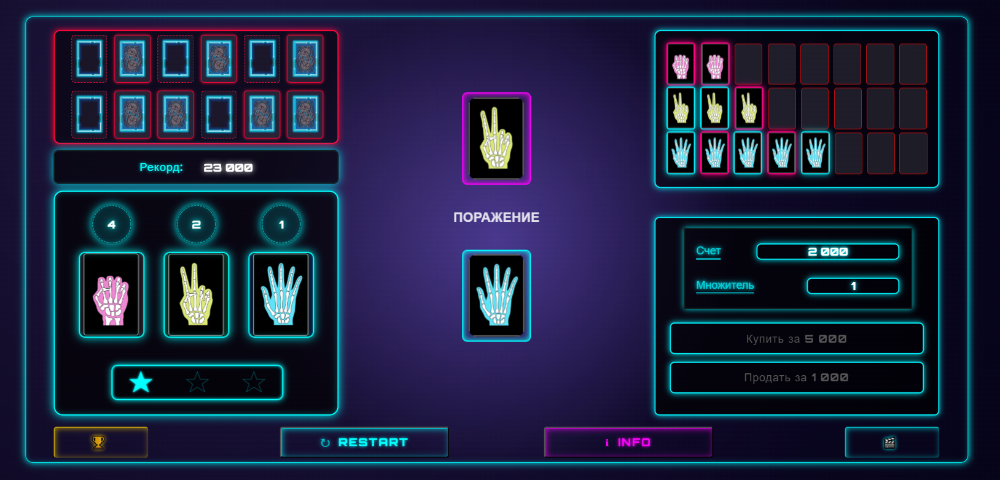

# ⚔️ Камень‑Ножницы‑Бумага: Выживание

> Тактическая десктоп-игра, в которой классическая механика превращается в управление ресурсами и борьбу за выживание.


*Основной экран: коллекция карт, счёт, множитель очков и запас жизней*

---

## 📖 О проекте

Игра разрабатывалась для публикации на платформе **Яндекс Игры**, но при этом полностью автономна — в проекте реализована эмуляция SDK (реклама, лидерборд, сохранения).

Это не просто «камень-ножницы-бумага». Это **survival с экономикой**:

- 🃏 **12 карт** на всю игру (по 4 камня, ножниц, бумаги)
- ❤️ **3 жизни** на старте, каждое поражение отнимает одну
- 💰 **Покупка и продажа жизней** — динамическая цена зависит от текущего счёта
- 📈 **Множитель очков** — растёт от серий побед, падает при проигрыше
- 📊 **Коллекция сыгранных карт** — можно анализировать свои ходы

🎯 **Цель:** продержаться 12 раундов, сохранить хотя бы одну жизнь и набрать максимум очков.

> *Никто ещё не выигрывал 12 раундов подряд. Ключ к успеху — баланс между агрессией и сохранением HP.*

---

## 🏆 Лидерборд и прогресс


*Таблица рекордов: игроки, счёт, дата*

В игре реализована эмуляция лидерборда — результаты сохраняются локально.  
Это позволяет тестировать прогресс и соревноваться с самим собой, даже без подключения к платформе.

---

## 🛠️ Стек технологий

- ⚛️ **React** — компонентная архитектура
- 📦 **Webpack** — сборка проекта
- 🟨 **JavaScript (ES6+)** — игровая логика
- 🌐 **HTML5 / CSS3** — вёрстка и стилизация  

---

## 🚀 Запуск проекта локально

```bash
# Клонировать репозиторий
git clone https://github.com/Andreev-dev-94/challenge_of_12.git

# Перейти в папку проекта
cd challenge_of_12\challenge

# Установить зависимости
npm install

# Запустить dev-сервер
npm start
